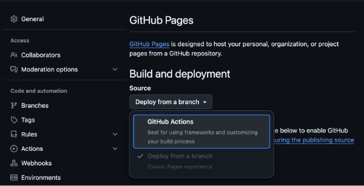

## はじめに

Astro で作ったサイトを GitHub Pages にデプロイする方法について紹介します。
GitHub Pages を使うことで簡単に作ったサイトを公開することができます。

基本的には公式サイトのドキュメント通りにやればできるでしょう。
ここではカスタムドメインを使わないリポジトリ名が後ろにつくデプロイ方法を紹介します。

https://docs.astro.build/ja/guides/deploy/github/

## GitHub Pages 用に Astro の設定をする

`astro.config.mjs` に`site`と`base`オプションの設定を追加します。

```js {4-5} title="astro.config.mjs"
import { defineConfig } from "astro/config";

export default defineConfig({
  site: "https://<username>.github.io",
  base: "<your-repo-name>",
});
```

ここで`site`の username にはご自身の GitHub のユーザー名を、`base`の your-repo-name にはデプロイするリポジトリ名入れてください。

## GitHub Actions の設定

最後に GitHub Actions の設定をします。
プロジェクトのルートに`.github/workflows/deploy.yml`を作成し以下の YAML を記述します。

```yml title=".github/workflows/deploy.yml"
name: Deploy to GitHub Pages

on:
  # `main`ブランチにプッシュするたびにワークフローを実行します。
  # 異なるブランチ名を使用する場合は、`main`をブランチ名に置き換えてください。
  push:
    branches: [main]
  # このワークフローをGitHubのActionsタブから手動で実行できるようにします。
  workflow_dispatch:

# このジョブがリポジトリをクローンし、ページデプロイメントを作成することを許可します。
permissions:
  contents: read
  pages: write
  id-token: write

jobs:
  build:
    runs-on: ubuntu-latest
    steps:
      - name: Checkout your repository using git
        uses: actions/checkout@v4
      - name: Install, build, and upload your site
        uses: withastro/action@v3
        # with:
        # path: . # リポジトリ内のAstroプロジェクトのルートロケーション。（オプション）
        # node-version: 20 # サイト構築に使用するNodeのバージョン。デフォルトは20です。（オプション）
        # package-manager: pnpm@latest # 依存関係のインストールとサイトのビルドに使用するNodeパッケージマネージャ。ロックファイルに基づいて自動的に検出されます。（オプション）

  deploy:
    needs: build
    runs-on: ubuntu-latest
    environment:
      name: github-pages
      url: ${{ steps.deployment.outputs.page_url }}
    steps:
      - name: Deploy to GitHub Pages
        id: deployment
        uses: actions/deploy-pages@v4
```

これでコードの設定は完了です。この内容で GitHub にプッシュすると、GitHub Actions が自動でデプロイしてくれます。

## GitHub の Settings からページの設定をする

GitHub にプッシュしたら、リポジトリの Settings から Pages の設定をしましょう。
Build and deployment の Source を GitHub Actions に変更します。



以上でデプロイは完了です。
公開後の URL は`https://<username>.github.io/<your-repo-name>/`となります。

## まとめ

Astro で作ったサイトを GitHub Pages にデプロイする方法について紹介しました。
Astro でも GitHub Pages を使うことで簡単に作ったサイトを公開できることが確認できたので今後も活用していきたいと思います!
