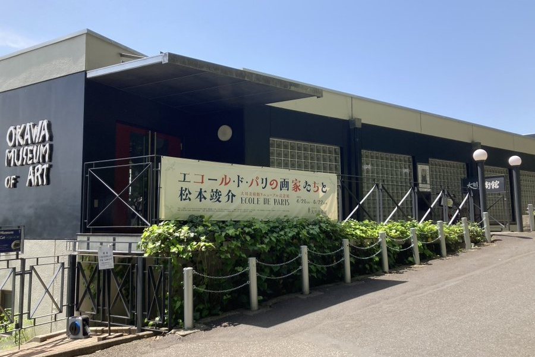
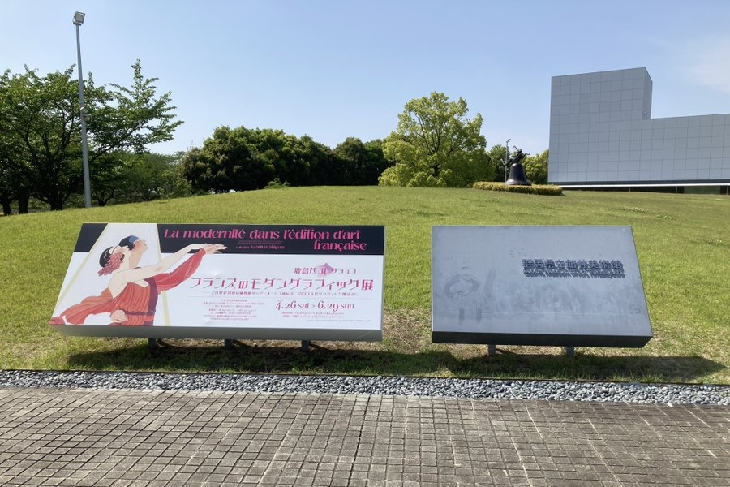

import Youtube from "@/components/markdown/Youtube.astro";
import AmazonLink from "@/components/markdown/AmazonLink.astro";

2025-05-05 に大川美術館と館林美術館に行ったのでその日記

## 大川美術館

リニューアル記念展とのことで、GW に行きたいと思っていた大川美術館に行ってきました。

> 松本竣介は 1912(明治 45)年に生まれました。太平洋美術研究所(後に学校)に学び、二科会、新人画会、自由美術家協会を中心に作品を発表、戦後間もない 1948(昭和 23)年に亡くなっています。この間、当時の多くの日本の洋画家達がヨーロッパの新しい美術思潮に大きな影響を受けその画業に反映してきましたが、松本竣介もその一人で、とりわけエコール・ド・パリの画家たちに強い関心を寄せます
> https://artscape.jp/exhibitions/35350/

大川美術館の創設者大川栄二（1924－2008）が、美術コレクションをはじめるきっかけとなったのが松本竣介の作品でした。その松本竣介が関心を寄せていたエコール・ド・パリの画家たちと松本竣介の作品を展示していました。

松本竣介が集めたエコール・ド・パリ関連の蔵書やスクラップブックなどを展示してあり良かったです。

今回の展示の松本竣介作品で[街](https://okawamuseum.jp/matsumoto/image/001.jpg)が印象的でした。どことなくシャガールに影響を受けた感じがして好きでした。

また、ポスターのメインビジュアルにあるモディリアーニの「少女の肖像(ジャンヌ・ユゲット)」も見られて良かったです。

余談ですが、モディリアーニの伝記映画の「モンパルナスの灯」は自分の好きな映画の一つです。

<Youtube videoId="2owsyf-MNZI" />

他にも自分はオノサト・トシノブの好きなのですが、見れて良かったです！

---

## 館林美術館

大川美術館に行った後は、館林美術館に行ってきました！

> 本展は、膨大な古書コレクターとして知られるフランス文学者、鹿島茂氏のコレクションより、20 世紀前半フランスの書籍・雑誌におけるグラフィック—イラストレーションや写真の図版に注目し、新しい時代の表現、すなわち「モダン」の様相を探るものです。

今回の企画展で初めて、鹿島茂氏を知りました。膨大なフランスのイラストレーションや写真の図版が展示してありました。

本展では、鹿島茂コレクションの 20 世紀前半の作品を綜覧することができました。前半は、風刺雑誌から、ファッションやバレエのイラストレーション、都市生活を反映するデパートの出版物、1920 年代におけるアール・デコの豪華挿絵本、そして写真が主役となる 1930 年代のグラフィック雑誌まで、フランスのグラフィックに登場したモダンな表現やデザインを見ていくことができ非常に勉強になりました！

最初に大川美術館でエコール・ド・パリの画家たちを見て、繋がるところがあったので、こちらも見れて良かったです！

展示の後半では、写真や印刷技術の発展によりグラフィックの主役は次第に写真へ移り、1920 年代末に創刊されたグラフィック雑誌『アール・ゼ・メティエ・グラフィック』や写真報道雑誌『ヴュ』などの、モダンなタイポグラフィやエディトリアルデザインを見ることができました。

今回の展示ではないのですが、Youtube に鹿島茂氏によるアール・デコの造本技術の本人解説がありこちらも良いのでぜひ見てみてください！

<Youtube videoId="nWeod9D7_8s" />

他にも氏の書籍などを読みたいと思いました！

<AmazonLink
  imageId="71VYuQ3VOuL._SY522_"
  linkId="42IruAT"
  title="古本屋の誕生: 東京古書店史"
  author="鹿島茂"
/>

## まとめ

GW に大川美術館と館林美術館に行きました。期せずフランスづくしを堪能して良かったです！
どの企画展も期日は 6 月末ごろなので気になった方はぜひ行ってみてください！
