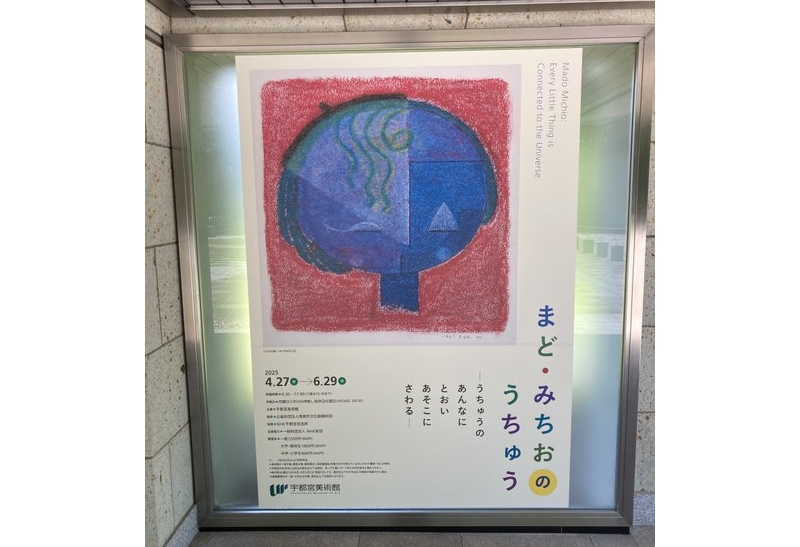

import AmazonLink from "@/components/markdown/AmazonLink.astro";

2025-05-11 に「まど・みちおのうちゅう」宇都宮美術館の企画展に行ったのでその日記
すごく刺激になった。

## 概要

> 「ぞうさん」「やぎさん ゆうびん」など、誰もがいちどは口ずさんだことのある童謡の作詞者として、また平明な日本語で生命や事物の存在を寡黙に言祝ぐ詩の紡ぎ手として親しまれ、2014 年に 104 歳でこの世を去った詩人まど・みちお(1909-2014)。
> 50 代前半の一時期、彼は人知れず絵の制作に没頭しました。その多くは「この世にあるもの」をなぞらずに生まれて来た抽象画です。詩人の故郷に建つ周南市美術博物館のコレクションから精選した作品群を中心に、ときに苛烈さを秘めながらも慈しみをたたえ、宇宙に直結するかのような深い響きを宿す絵の数々をまとめて展観します。
> 絵画作品約 60 点に加え、原稿、創作ノートや書籍などの資料約 240 点を展示。この稀有な詩人の足跡、そしてその心に映った宇宙の姿をたどります。

まど・みちおさんは童謡の作詞や詩人として有名ですが、絵を描いていたことを知らなかったので、その絵を見ることができて良かったです。

絵を描いていた時期は、1961 年から 1964 年にかけての 4 年間が主で、本展覧ではその時期に描かれた抽象画が展示されていました。また、スケッチや創作ノート、まど・みちおさんの 100 歳を超える生涯の歩みをたどれる資料も展示されていました。

https://www.artpr.jp/u-moa/madomichio2025

## まど・みちおの絵画技法

まど・みちおさんは独学で絵を描いていたようです。画材としてはクレヨンや水彩、ボールペンなどの身近な画材を使って「造形あそび」と評していい技法で描かれたことが、直に見て感じました。

主な特徴は下記です。

- 渦を巻く筆跡
- 絵具を吹き流す
- 紙を削る
- 削って灯す

まど・みちおさんの描く抽象画は、近くで見るとこのような特徴を感じることができ生で見れて良かったです。このようなテクスチャ感にすごく憧れてしまいます。

## 宇都宮美術館での展示

「まど・みちおのうちゅう」は巡回だと思うのですが、宇都宮美術館ならではの展示は「セルジュ・ポリアコフ」と一緒の展示だと思います。

まど・みちおさんが好んだ画家の一人がポリアコフらしいです。宇都宮美術館所蔵のポリアコフ作品も紹介され同じ抽象画に共感を持って鑑賞できました。

https://www.mado-michio.com/

## 印象に残った作品

今回の展示で印象に残った作品です。

- 石
- 落下
- 亀裂
- 紙は哀しい
- 星がとおい

## 詩なども読みたい

今回の企画展が素晴らしく鑑賞後は図録を購入しました。
自分は普段は詩などは読まないのですが、まど・みちおさんの詩も読んでみたいと思いました！

<AmazonLink
  imageId="71UiOTmIEBL._SY522_"
  linkId="3F4ez3d"
  title="まど・みちお詩集 (ハルキ文庫 ま 1-1)"
  author="まど・みちお"
/>

<AmazonLink
  imageId="71Zust20DeL._SY522_"
  linkId="4m6KDEl"
  title="まど・みちお全詩集<新訂版>"
  author="まど・みちお"
/>

<AmazonLink
  imageId="71sANXq4B-L._SY522_"
  linkId="3YE9XY6"
  title="百歳日記 (生活人新書)"
  author="まど・みちお"
/>

## まとめ

宇都宮美術館でのまど・みちお企画展を観に行きました。
絵を描いてたのは 1961 年から 1964 年にかけての 4 年間とのことですが、圧巻の作品数で凄く刺激になりました！

宇都宮美術館での企画展は 6 月 29 日までです。気になった方はぜひ観に行ってみてください！
巡回もあるかもなので、お近くで開催されたら是非観に行ってみてください！
